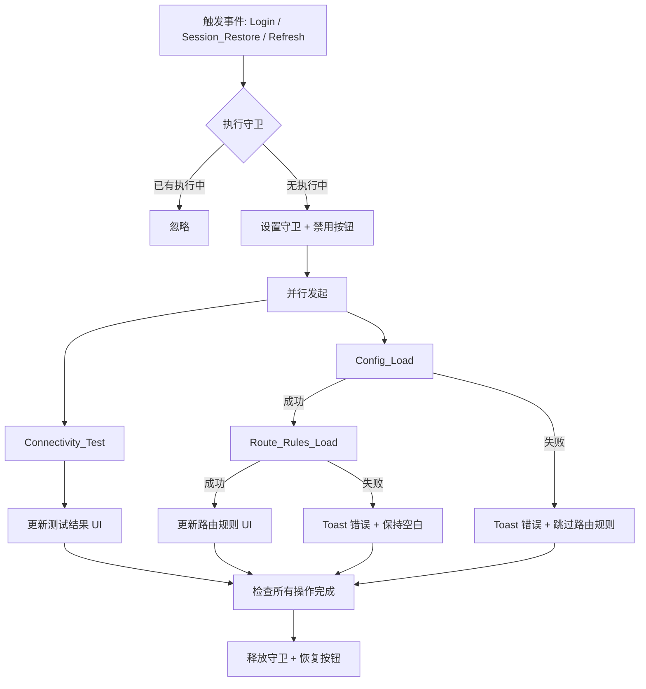

# Design Document: Auto Init Panel

## Overview

本设计为 Xray 管理面板增加自动初始化功能。在用户登录、会话恢复、点击刷新按钮三种场景下，面板自动执行连通性测试、配置加载、路由规则加载的编排流程。

核心设计目标：
- **并行执行**：Connectivity_Test 与 Config_Load 并行发起，减少等待时间
- **依赖链**：Route_Rules_Load 依赖 Config_Load 成功完成
- **防重复**：刷新按钮有执行守卫，防止重复触发
- **错误隔离**：各操作独立失败，不影响其他操作

## Architecture



### 触发点

| 触发场景 | 入口函数 | 附加行为 |
|---------|---------|---------|
| Login 成功 | `doLogin()` | 无 |
| Session 恢复 | `checkSession()` | 同时刷新 status 和 geodata |
| 点击刷新按钮 | `refreshStatus()` | 同时刷新 status |

## Components and Interfaces

### 1. `autoInit()` — 编排函数

主要编排函数，管理并行执行和依赖链。

```javascript
/**
 * 自动初始化编排函数
 * @returns {Promise<void>} 所有操作完成后 resolve
 */
async function autoInit() {
  // 执行守卫检查
  if (autoInitRunning) return;
  autoInitRunning = true;
  setRefreshButtonDisabled(true);

  try {
    // 并行启动 Connectivity_Test 和 Config_Load
    const testPromise = runTestsSafe();
    const configPromise = loadConfigSafe();

    // 等待 Config_Load，成功则链式执行 Route_Rules_Load
    const configResult = await configPromise;
    if (configResult.success) {
      await loadRouteRulesSafe();
    }

    // 等待 Connectivity_Test 完成（可能已完成）
    await testPromise;
  } finally {
    autoInitRunning = false;
    setRefreshButtonDisabled(false);
  }
}
```

### 2. 执行守卫模块

```javascript
/** 全局状态 */
let autoInitRunning = false;

/** 禁用/启用刷新按钮 */
function setRefreshButtonDisabled(disabled) {
  const btn = document.querySelector('.actions .btn-success');
  if (btn) {
    btn.disabled = disabled;
    btn.style.opacity = disabled ? '0.5' : '1';
    btn.style.pointerEvents = disabled ? 'none' : 'auto';
  }
}
```

### 3. 安全包装函数

为每个子操作提供错误隔离和 unauthorized 检测：

```javascript
/**
 * 安全执行连通性测试，捕获错误不向上抛出
 * @returns {Promise<{success: boolean}>}
 */
async function runTestsSafe() {
  // 显示加载状态
  // 执行测试
  // 处理 unauthorized → 触发 logout
  // 捕获并显示错误
}

/**
 * 安全执行配置加载，返回是否成功
 * @returns {Promise<{success: boolean}>}
 */
async function loadConfigSafe() {
  // 执行 config_get
  // 处理 unauthorized → 触发 logout
  // 失败时 toast + 返回 {success: false}
  // 成功时填充编辑器 + 返回 {success: true}
}

/**
 * 安全执行路由规则加载
 * @returns {Promise<{success: boolean}>}
 */
async function loadRouteRulesSafe() {
  // 从编辑器中解析 JSON
  // 提取 routing.rules
  // 失败时 toast + 保持空白
}
```

### 4. 超时控制

为 API 调用增加 30 秒超时：

```javascript
/**
 * 带超时的 API 调用
 * @param {string} action - API action
 * @param {object} data - 请求数据
 * @param {number} timeout - 超时毫秒数，默认 30000
 * @returns {Promise<object>} API 响应
 */
async function apiWithTimeout(action, data = {}, timeout = 30000) {
  const controller = new AbortController();
  const timer = setTimeout(() => controller.abort(), timeout);
  try {
    const result = await api(action, data, controller.signal);
    return result;
  } catch (e) {
    if (e.name === 'AbortError') {
      return { error: '请求超时' };
    }
    throw e;
  } finally {
    clearTimeout(timer);
  }
}
```

### 5. 修改现有函数的集成点

| 现有函数 | 修改内容 |
|---------|---------|
| `doLogin()` | 成功后调用 `autoInit()` 替代 `refreshStatus()` |
| `checkSession()` | token 验证通过后调用 `autoInit()` |
| `refreshStatus()` | 改为调用 `autoInit()` + status 刷新并行 |
| `api()` | 增加 AbortSignal 参数支持 |

## Data Models

### 状态模型

```javascript
/** Auto_Init 全局状态 */
const autoInitState = {
  running: false,           // 是否正在执行
  abortController: null,    // 用于 unauthorized 时终止所有请求
};
```

### API 响应接口（已有，无变更）

```javascript
// config_get 响应
{ config_b64: string }

// test 响应
{ results: { [id: string]: { ok: boolean, code: string, time: string } } }

// 错误响应
{ error: string }
```

### 执行结果模型

```javascript
/**
 * @typedef {Object} OperationResult
 * @property {boolean} success - 操作是否成功
 * @property {string} [error] - 失败原因
 */
```

## Correctness Properties

*A property is a characteristic or behavior that should hold true across all valid executions of a system—essentially, a formal statement about what the system should do. Properties serve as the bridge between human-readable specifications and machine-verifiable correctness guarantees.*

### Property 1: 并行执行与依赖链正确性

*For any* Auto_Init 执行实例，Connectivity_Test 和 Config_Load 应当并行启动（两者的开始时间差不超过一个事件循环 tick），且 Route_Rules_Load 仅在 Config_Load 成功 resolve 后才开始执行。

**Validates: Requirements 1.2, 1.3, 4.1, 4.2**

### Property 2: 执行守卫防重复

*For any* 序列的 autoInit() 调用，若第一次调用尚未完成（autoInitRunning === true），则后续调用应当被忽略（不启动新的执行），且刷新按钮在整个执行期间保持 disabled 状态。

**Validates: Requirements 3.3, 3.4**

### Property 3: Config_Load 失败阻断 Route_Rules_Load

*For any* Config_Load 返回错误响应（包括 API error、网络超时等），Route_Rules_Load 不应被执行，且 toast 应显示包含错误原因的提示。

**Validates: Requirements 4.3, 5.2**

### Property 4: Route_Rules_Load 解析失败处理

*For any* 配置 JSON 中缺少 `routing.rules` 字段或目标规则为空的情况，Route_Rules_Load 应显示解析失败 toast，且路由规则编辑器各字段保持为空字符串。

**Validates: Requirements 4.4, 5.4**

### Property 5: 测试结果独立性

*For any* 四个连通性测试目标的结果组合（每个目标可独立为成功、失败或超时），每个目标的 UI 显示仅取决于该目标自身的结果，不受其他目标结果影响。

**Validates: Requirements 5.1**

### Property 6: Unauthorized 全局终止

*For any* Auto_Init 执行过程中，若任一 API 请求返回 `{error: "unauthorized"}`，则所有尚未完成的请求应被终止（abort），且面板立即执行退出登录流程。

**Validates: Requirements 5.3**

### Property 7: 数据新鲜度

*For any* Auto_Init 成功完成后，配置编辑器的内容应等于 Config_Load API 返回的解码后的配置内容，路由规则编辑器应反映该配置中 routing.rules 的 office 和 direct 规则。

**Validates: Requirements 3.2**

## Error Handling

| 错误场景 | 处理方式 | UI 反馈 |
|---------|---------|---------|
| Connectivity_Test 单项超时 | 终止该请求，标记失败 | 对应项显示 `✗ 超时` |
| Config_Load API 错误 | 跳过 Route_Rules_Load | Toast 错误信息 3s |
| Config_Load 超时（30s） | 同上 | Toast "配置加载超时" 3s |
| Route_Rules_Load 解析失败 | 编辑器保持空白 | Toast "路由规则解析失败" 3s |
| 任意请求返回 unauthorized | 终止所有操作，执行 logout | 跳转到登录页 |
| 网络断开 | 各操作独立失败 | 各区域显示对应错误 |

### 错误传播策略

- **隔离原则**：每个操作的错误被 try-catch 捕获，不影响其他并行操作
- **唯一例外**：`unauthorized` 错误触发全局终止
- **AbortController** 用于实现超时和全局终止

## Testing Strategy

### 属性测试（Property-Based Testing）

本功能适合属性测试，因为：
- 编排逻辑是纯粹的控制流，输入（API 响应）可随机生成
- 并行/串行行为、守卫机制有明确的不变量
- 错误组合空间大（4 个测试目标 × 3 种状态 = 81 种组合）

**PBT 库**：使用 [fast-check](https://github.com/dubzzz/fast-check) (JavaScript property-based testing library)

**配置**：
- 每个属性测试至少运行 100 次迭代
- 每个测试标记对应的 Property 编号

**标记格式**：
```javascript
// Feature: auto-init-panel, Property 1: 并行执行与依赖链正确性
```

### 单元测试

| 测试用例 | 验证内容 |
|---------|---------|
| Login 成功触发 autoInit | 需求 1.1 |
| Session 恢复触发 autoInit | 需求 2.1 |
| 加载状态指示器显示/隐藏 | 需求 1.4, 2.2 |
| 超时后显示错误 | 需求 1.5 |
| Toast 持续 3 秒 | 需求 4.3, 5.2 |

### 测试环境

- 测试框架：Vitest（轻量、ESM 兼容）
- DOM 模拟：jsdom 或 happy-dom
- API Mock：vi.fn() 模拟 fetch
- Timer Mock：vi.useFakeTimers() 控制超时和 debounce

### 测试文件结构

```
xray-panel/tests/
├── auto-init.test.js          # 单元测试
└── auto-init.property.test.js # 属性测试
```
